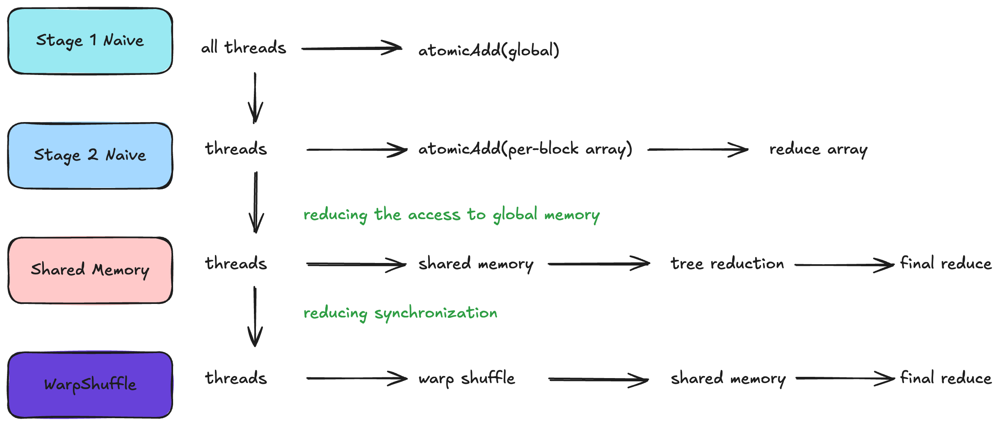
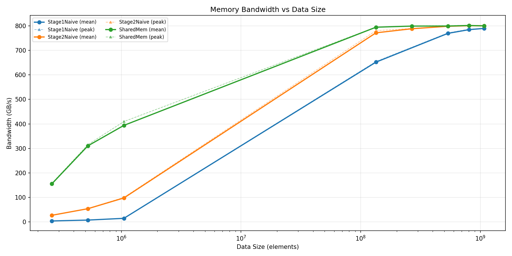

# Vector Dot Product - CUDA Kernel Implementations

Parallel GPU implementations of vector dot product with progressive optimization strategies.

**Problem**: Compute dot product of two float vectors: 
$$
result =  \sum_{i=0}^{n-1} a_{i} \cdot b_{i} 
$$

## Implementations

| Kernel | Strategy | Synchronization | Expected Performance | Status |
| -------- | -------- | -------- | -------- | -------- |
| Stage1Navive | Single-stage atomic reduction | Global atomic (high contention) | Baseline (worst) | Implementated |
| Stage2Naive | Two-stage with per-block atomics | Atomic per block | Better | Implemented |
| SharedMem | Two-stage with shared memory reduction | Shared memory + tree reduction | Best | Implemented |
| WarpShuffle | Warp-level primitives | Warp shuffle instructions | Future optimization | TODO |

## Kernel Descriptions

### Stage1Navive

**Strategy**:

- grid-stride loop for load balancing across any data size
- each thread compute partial sum
- all threads atomically add their result to a single global `result` variable

**Code Pattern**:

```cuda

for (int i = idx; i < n; i += stride) {
    sum += a[i] * b[i];
}
atomicAdd(result, sum); // high contention

```

**Performance**:

- very slow, becase all the threads update the same location, the GPU must serialize these operations.

## Optimization Progression

### Problem

The dot-product is a **reduction problem**: many inputs -> single output. Naive approache faces:

1. **Contention**: All threads competing for the same output location
2. **Serialization**: Atomic operations force sequential execution

### Solution strategy: Hierarchical Reduction

**Key insight**: Match GPU memory hierarchy levels (global -> shared -> registers)



## Performance

**Test Configuration**:

- GPU: NVIDIA RTX 3090 (Ampere, compute capability 8.6)
- Block size: 256 threads
- Max grid blocks: 1024
- Warmup iterations: 10
- Trial runs: 5
- Data type: `float` (4 bytes)

**Bandwidth**:

